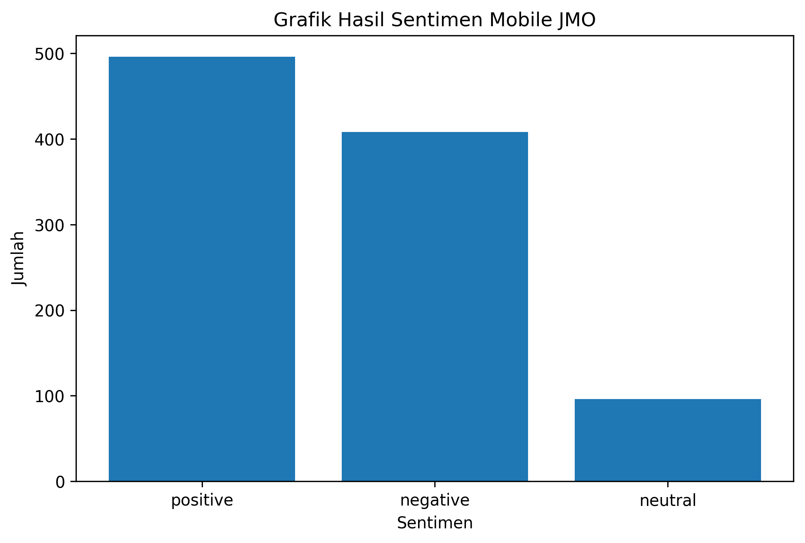

# Analisis Sentimen Mobile JMO

## UTS_Big-Data

**Nama:** Fuji Yanti  
**NIM:** 14022300008  
**Prodi:** Sistem Informasi  

## Deskripsi Project
Project ini berisi analisis sentimen komentar pengguna aplikasi Mobile JMO dari Google Play Store.

## Dataset
Data diperoleh menggunakan library `google-play-scraper`.

**Jumlah data:** 1000 komentar.

## Kolom Dataset
- **userName**: nama pengguna
- **score**: rating pengguna
- **at**: tanggal ulasan
- **content**: isi komentar
- **sentimen**: hasil klasifikasi sentimen
- **confidence**: tingkat keyakinan model

## Metode Analisis
Analisis sentimen dilakukan menggunakan pendekatan **Natural Language Processing (NLP)** dengan model **IndoRoBERTa** dari Wilson Wongso.

**Model yang digunakan:**

`w11wo/indonesian-roberta-base-sentiment-classifier`

Model ini mengklasifikasikan komentar menjadi:
- positive
- negative
- neutral

## Hasil Count Sentimen

| Sentimen | Jumlah | Persentase |
|----------|--------|------------|
| Positive | 491    | 49.1%      |
| Negative | 409    | 40.9%      |
| Neutral  | 100    | 10.0%      |

## Grafik Hasil Sentimen

## Kesimpulan
Berdasarkan hasil analisis terhadap 1000 komentar pengguna Mobile JMO, sentimen positif memiliki jumlah terbanyak yaitu 491 komentar atau 49.1%. Sentimen negatif berjumlah 409 komentar atau 40.9%, sedangkan sentimen netral berjumlah 100 komentar atau 10.0%.

Hasil ini menunjukkan bahwa mayoritas komentar pengguna cenderung positif, namun jumlah komentar negatif juga cukup tinggi. Hal ini menandakan bahwa aplikasi Mobile JMO cukup membantu sebagian pengguna, tetapi masih terdapat banyak keluhan terkait pengalaman penggunaan aplikasi.

## Tools
- Google Colab
- Python
- Pandas
- Transformers
- Torch
- Matplotlib
- Google Play Scraper
